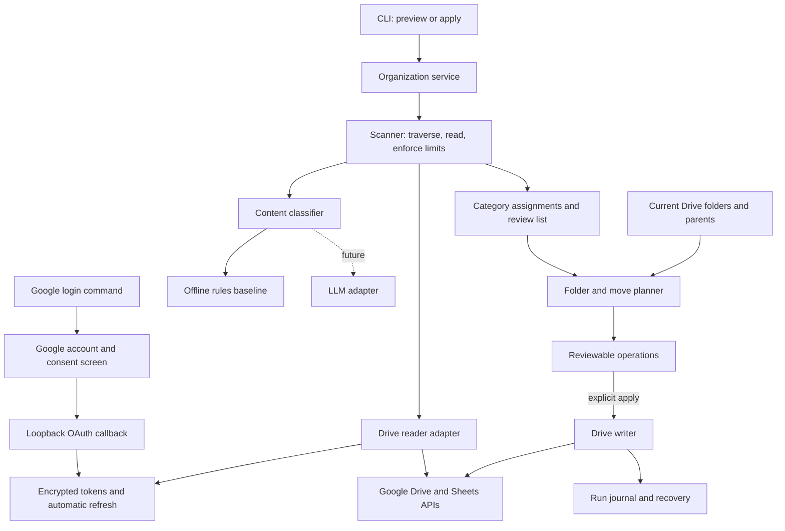
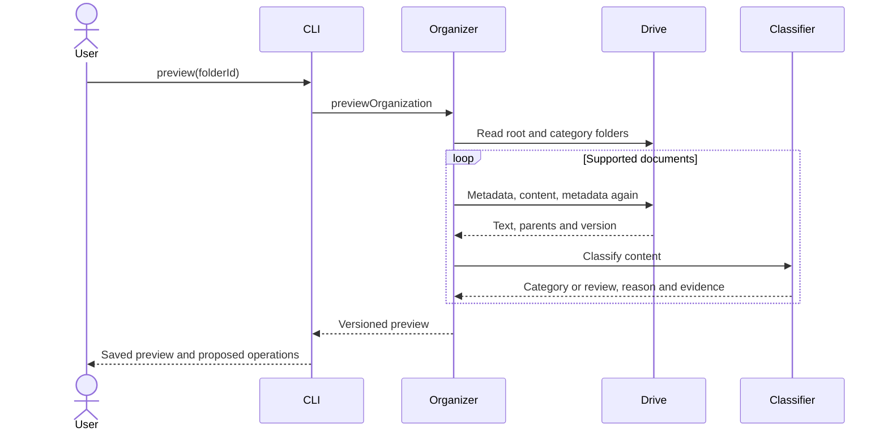
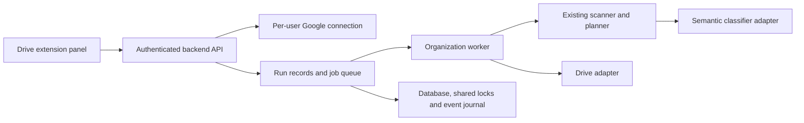

# Braino project architecture

Updated: 12 September 2026

## System status

Braino is a local TypeScript application running on Node.js 24+. Users connect
Google Drive, scan one folder, review content-based category assignments and
explicitly apply moves. Google login uses a local callback server; the organizer
is currently operated through command-line tools.

Implemented: Google OAuth login/refresh/logout, encrypted token storage, Drive
and Sheets readers, classification rules, folder planning, verified moves, local
locking and an event journal. The extension UI, hosted application API, semantic
LLM classifier and cited workspace chat are not implemented.

## Product behavior

Read Docs and Sheets inside one selected Drive folder, classify their contents,
and propose category folders with document placements. The current categories
are School, Meetings, Finance, Business and Personal. Ambiguous documents remain
in place for review. This extends the original handoff's linked knowledge-base
idea with the user's requested organization of original documents.

## Technology choices

| Concern | Current choice | Purpose |
| --- | --- | --- |
| Runtime | Node.js 24+, native TypeScript execution | Shared runtime for the core and scripts |
| Type validation | Strict TypeScript with no emit | Check interfaces without a build directory |
| OAuth | Official Google authentication library | Code exchange, identity verification and token refresh |
| API transport | Node fetch through the Drive adapter | Small, mockable Google API boundary |
| Classification | English content keyword rules | Runnable baseline behind a replaceable classifier interface |
| Persistence | Private JSON artifacts and JSONL events | Inspectable local preview and execution history |
| Credential storage | AES-256-GCM encryption | Store tokens separately from their local encryption key |
| Tests | Node test runner | Domain, adapter and callback tests |

## Implemented modules

| Module | Responsibility |
| --- | --- |
| `src/brain.ts` | Read-only traversal, limits, source links, original wiki-page grouping and write planning |
| `src/structure.ts` | Content classifier port, offline classifier, category report, pure folder/move planner |
| `src/drive.ts` | Authenticated HTTP reader, worksheet text, category-folder creation and verified moves |
| `src/organizer.ts` | Versioned preview, stale-state checks, ancestry validation and apply orchestration |
| `src/cli.ts` | Preview/apply commands, local folder lock, private artifacts and durable event journal |
| `src/auth/` | Local Google OAuth flow, callback session validation, encrypted login storage and automatic token refresh |
| `examples/structure.ts` | Runnable demo and real connector-snapshot classification preview |
| `examples/connector-scan.ts` | Verify delivery of connector-retrieved text into the scanner |
| `test/` | Traversal, classification, validation and rerun behavior |

The content classifier never receives OAuth credentials. It returns a category
and evidence; it cannot choose Drive IDs or execute operations. The planner owns
placement decisions and the Drive adapter owns external mutations.

`structureFolder` reuses the existing scanner through its extractor callback;
there is one traversal implementation. The structuring flow returns category
assignments instead of using the scanner's legacy wiki pages. The small amount
of unused wiki assembly is an acceptable current tradeoff; separate a shared
scanner only when a second production caller needs independent lifecycle control.

## Authentication flow

1. A developer creates a Google OAuth Web application client and registers
   `http://127.0.0.1:43821/oauth/callback`.
2. `auth login` starts a loopback listener and prints a local connection link.
3. Opening the link creates random state, nonce and PKCE parameters and a browser
   cookie, then redirects to Google's account-selection and consent page.
4. The callback checks state and cookie before exchanging the authorization code.
5. Google's library verifies the ID token; Braino checks its nonce, verified email,
   client audience and granted Drive scope.
6. The login is encrypted locally. The organizer refreshes its access token when
   near expiry. Passwords never pass through Braino.

The current scopes are `openid`, `email` and full `drive` access, because the
organizer moves existing files. This OAuth grant is broader than the selected
folder; application code enforces the folder boundary. The public product needs
the applicable Google verification for this restricted scope. A per-file grant
would require a different source-authorization workflow.

One Google account is saved per checkout. Login replaces that account; status
reports its local record, and logout attempts revocation before clearing it.
Do not change accounts during an organizer run.

## Scan and preview flow

The reader lists all direct-child pages, while the scanner traverses descendants,
deduplicates IDs and avoids cycles. Defaults are 30 attempted supported files,
100 folders and 100,000 characters per source. Failed reads count toward the file
cap. These caps limit processing; they do not bound every listing API call.

Docs use text export. Sheets are read worksheet by worksheet with names and cell
boundaries preserved. Unsupported formats are reported. Empty, oversized or failed
sources and reached traversal limits mark the run incomplete and block apply.

Generated output IDs, `brainoManaged=true` files and folders named `Braino` are
excluded. The name fallback can also exclude a user folder with that exact name.
Shared-drive files, non-grid worksheets, OCR and full fidelity of multi-tab Docs
or embedded objects are outside the current reader's guarantees.

## Classification contract

`Classifier({ file, text })` returns a category ID or null, reason, exact source
excerpts and method identifier. Only configured category IDs are accepted.
Evidence must occur in the source. Model output cannot choose Drive IDs, paths,
operations or tools. This validation establishes provenance, not semantic truth.
An eventual LLM adapter must treat document text as data, use structured output,
and be evaluated against labeled documents before unattended organization.

The offline baseline counts distinct whole-word/phrase matches in content only.
At least two signals and a lead of two over the next category are required.
It ignores filenames and repeated keywords. These are English keyword heuristics,
not calibrated confidence or semantic AI. Mixed-topic and non-English documents
may need review. Categories are flat and each classified document has one target.

## Data contracts

| Contract | Key fields | Purpose |
| --- | --- | --- |
| `DriveFile` / `Metadata` | ID, name, MIME type, markers; parents and version | Identify the source and current Drive state |
| `Classification` | Category or null, reason, exact excerpts, method | Explain a placement or defer it for review |
| `StructureReport` | Source folder, completeness, documents, category groups, review IDs, errors and skipped files | Describe the scan outcome |
| `FolderState` | Source folder, category-folder mappings and current file parents | Ground the move plan |
| `Preview` | Schema version, timestamp, report, folder state and source versions | Persist the inspected state before apply |
| `Operation` | Ensure-folder or move, destination key and expected parents | Describe a legal external change |
| `SavedLogin` | Client ID, account identity, tokens, expiry and scopes | Reuse the authorized Google connection |
| Journal event | Type, timestamp, file ID and relevant old/new parents | Diagnose partial execution |

Logical destination keys use `<sourceFolderId>:<categoryId>`. Category folders are
flat children of the selected root. Unmarked folders with the same name are not
automatically adopted; only verified category metadata identifies existing output.

## Planning and persistence contracts

The backend passes fresh category-folder mappings and document parents, scoped to
the selected source folder. Reuse category folders by persisted category metadata,
not name alone. Plans contain stable folder keys and expected current parents.
Already placed documents produce no move. Missing metadata, incomplete scans or
ambiguous multiple parents block the plan. Unclassified documents produce no move
but do not prevent independently classified documents from appearing in a plan.

The CLI acquires a local run lock per source folder. The organizer compares file
versions before/after reading, saves versions in the preview, and rechecks all
planned source files before applying. It checks each source again immediately
before its move, including parent ancestry back to the selected root. Destination
metadata is also reread. It resolves category keys to real IDs, moves using verified
add/remove parents, and verifies the resulting parent through readback.

The journal is flushed before each move and records its old/new parents and outcome.
Folder creation uses persisted category metadata for reuse. An uncertain write is
not retried automatically. After failure, inspect the journal and create a fresh
preview. Partial writes can leave folders or earlier moves in place; there is no
transaction or automatic rollback. Original documents are never deleted.

Google Drive state can still change between the final read and a write; these
checks are optimistic, not an atomic conditional transaction. Concurrent applies
across hosts/checkouts are unsupported. A production backend needs a shared lock,
durable run database and explicit reconciliation for uncertain operations.

A fresh scan after successful placement produces no move for already organized
documents. A partial failure can leave created folders or earlier moves in place.
Inspect the journal and current Drive state before making a new preview. Folder
moves can affect inherited access; the future review UI should show destination
access before execution.

The preview JSON is trusted local application state, not a public API request
format. A hosted service must validate inputs and bind previews to authenticated
users and server-side run records before accepting apply requests.

Category folders containing originals must remain traversable on reruns; do not
mark them `brainoManaged=true` (that marker excludes generated wiki output).
Use separate category metadata, such as `brainoCategory` and `brainoSourceFolder`.

## Storage and trust boundaries

| Location | Contents | Handling |
| --- | --- | --- |
| `.env` | OAuth configuration and encryption key | Local configuration; ignored by Git |
| `private-data/google-login.enc` | Encrypted saved login | Replaced after login/refresh and cleared on logout |
| `private-data/*.json` | Previews containing metadata and evidence excerpts | Private artifacts; existing previews are not overwritten |
| `private-data/*.jsonl` | Timestamped apply events | Flushed before moves; retained for recovery |
| `private-data/*.lock` | Lock for the selected source folder | Prevent concurrent applies from this checkout |
| Drive app properties | Category and source-folder markers | Reconcile folder identity on subsequent runs |

Document text is processed in memory, but previews contain excerpts and connector
snapshots may contain complete text. Git ignore rules do not remove data already
tracked or uploaded. Treat these artifacts as private data.

Someone with access to both `.env` and the encrypted credential file can decrypt
the tokens. Protect both through filesystem permissions and avoid shared storage.
Production hosting needs managed secrets and isolated per-user credential records.

The OAuth callback is loopback-only and requires state, browser cookie, PKCE and
an identity nonce. Responses use no-store headers. Tokens are not rendered or
written into reports. Document contents are untrusted data; future LLM adapters
must never follow embedded instructions to call tools or change permissions.

## Target extension and backend

The Chrome extension is the planned user-facing shell inside Google Drive. It
will reuse the domain modules through an authenticated backend. Refresh tokens
and LLM keys belong on that backend, not in the content script.

The following routes are proposed boundaries, not implemented application APIs:

| Endpoint | Responsibility |
| --- | --- |
| `GET /auth/google/start` | Start consent for the authenticated application user |
| `GET /auth/google/callback` | Verify the callback and save that user's grant |
| `GET /connection` | Return connection state without exposing tokens |
| `DELETE /connection` | Disconnect and revoke access |
| `POST /runs` | Start a bounded scan of an authorized folder |
| `GET /runs/:id` | Return progress, errors and classification preview |
| `POST /runs/:id/apply` | Apply a reviewed plan after fresh preflight |

Every run must belong to an application user and a Google account. Workers need
durable jobs, shared per-folder locks and reconciliation for uncertain operations.
The UI should display folder assignments, evidence, review items and partial
failure outcomes. CLI artifacts are not a substitute for a multi-user database.

## Integration still required

- Extension UI and backend run lifecycle: scan, classify, preview, apply, complete
  or failed. No HTTP service is implemented yet.
- Hosted multi-user OAuth sessions and token isolation. A local single-account
  Google OAuth flow and token refresh now exist, alongside the paginated Drive
  reader and all-grid-worksheet Sheets reader. Docs currently use text export;
  multi-tab fidelity, embedded objects and OCR are outside this implementation.
- Semantic LLM adapter and classification evaluation set.
- Shared persistent run state, cross-host concurrency and automated reconciliation.
  Metadata reads, folder creation, moves, a local journal and local locking exist.
- The move-versus-shortcut product choice: current plans describe moves, but this
  CLI executes them only through the explicit apply command. A shortcut mode needs its own planner
  and deduplication identity before being offered.

The core is backend-only TypeScript on Node 24. Scanning and planning are dependency-free;
OAuth uses Google's official authentication library. OAuth credentials
and LLM keys belong on the backend. Keep document snapshots and reports out of Git.
Raw document text need not be persisted by the core; the caller owns its retention.

The local auth flow is documented in [Google login setup](google-login.md).
The token key is kept in `.env` and the encrypted credential file in `private-data`.
This is one local account per checkout, not a multi-tenant authentication backend.

## Validation and next delivery steps

The current suite has 29 passing tests covering traversal/caps, classification,
folder reuse, source versions, ancestry, API pagination, worksheet reading,
readback, journal failures, encrypted storage, refresh and OAuth callbacks.
Run `npm test` and `npm run typecheck`.

External API and token-exchange behavior is mocked in the tests. The authorization
URL uses Google's real client library. An earlier connector test read 42 Docs and
passed 40 nonempty documents through the scanner; it did not verify standalone
OAuth or real Drive moves.

Next delivery steps:

1. Configure Google Cloud and verify real login, refresh and logout.
2. Verify preview, apply and a no-change rerun in a non-sensitive test folder.
3. Add a semantic `Classifier` adapter and evaluate it against labeled documents.
4. Implement backend run APIs, per-user state and durable execution.
5. Connect the extension's scan, review and apply interface.
6. Add the separate linked knowledge-base and cited-chat workflow if retained.

## API references

- [Drive folder creation and moves](https://developers.google.com/workspace/drive/api/guides/folder)
- [Drive scope definitions](https://developers.google.com/workspace/drive/api/guides/api-specific-auth)
- [Drive exports](https://developers.google.com/workspace/drive/api/guides/manage-downloads)
- [Sheets reading](https://developers.google.com/workspace/sheets/api/samples/reading)
