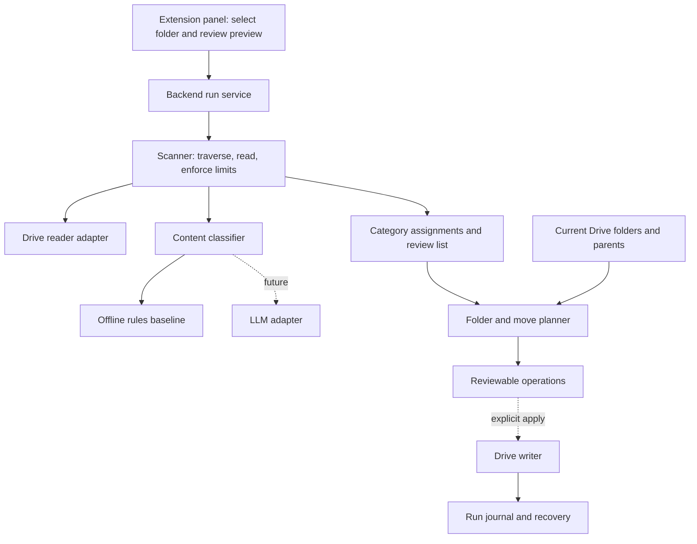

# Braino architecture

## Product behavior

Read Docs and Sheets inside one selected Drive folder, classify their contents,
and propose category folders with document placements. The current categories
are School, Meetings, Finance, Business and Personal. Ambiguous documents remain
in place for review. This extends the original handoff's linked knowledge-base
idea with the user's requested organization of original documents.

## Implemented modules

| Module | Responsibility |
| --- | --- |
| `src/brain.ts` | Read-only traversal, limits, source links, original wiki-page grouping and write planning |
| `src/structure.ts` | Content classifier port, offline classifier, category report, pure folder/move planner |
| `examples/structure.ts` | Runnable demo and real connector-snapshot classification preview |
| `examples/connector-scan.ts` | Verify delivery of connector-retrieved text into the scanner |
| `test/` | Traversal, classification, validation and rerun behavior |

`structureFolder` reuses the existing scanner through its extractor callback;
there is one traversal implementation. The structuring flow returns category
assignments instead of using the scanner's legacy wiki pages. The small amount
of unused wiki assembly is an acceptable current tradeoff; separate a shared
scanner only when a second production caller needs independent lifecycle control.

## Classification contract

`Classifier({ file, text })` returns a category ID or null, reason, exact source
excerpts and method identifier. Only configured category IDs are accepted.
Evidence must occur in the source. Model output cannot choose Drive IDs, paths,
operations or tools. This validation establishes provenance, not semantic truth.
An eventual LLM adapter must treat document text as data, use structured output,
and be evaluated against labeled documents before unattended organization.

The offline baseline counts distinct whole-word/phrase matches in content only.
At least two signals and a lead of two over the next category are required.
It ignores filenames and repeated keywords. These are English keyword heuristics,
not calibrated confidence or semantic AI. Mixed-topic and non-English documents
may need review. Categories are flat and each classified document has one target.

## Planning and persistence contracts

The backend passes fresh category-folder mappings and document parents, scoped to
the selected source folder. Reuse category folders by persisted category metadata,
not name alone. Plans contain stable folder keys and expected current parents.
Already placed documents produce no move. Missing metadata, incomplete scans or
ambiguous multiple parents block the plan. Unclassified documents produce no move
but do not prevent independently classified documents from appearing in a plan.

The future writer must acquire a run lock per source folder, reread source and
destination metadata and revalidate the preview before applying. A changed parent,
content revision or permission invalidates that document's operation. Ensure each
category folder once, resolve logical keys to actual IDs, then move each document
with verified add/remove parents. Persist operation IDs, old/new parents, content
revision and outcomes for retry/recovery. Do not blindly retry an uncertain create.
Reconcile existing folder metadata first. Partial write success requires readback
and a fresh plan, not an assertion of atomicity. Never delete originals.

Category folders containing originals must remain traversable on reruns; do not
mark them `brainoManaged=true` (that marker excludes generated wiki output).
Use separate category metadata, such as `brainoCategory` and `brainoSourceFolder`.

## Integration still required

- Extension UI and backend run lifecycle: scan, classify, preview, apply, complete
  or failed. No HTTP service is implemented yet.
- Standalone OAuth and paginated Drive reader, including all worksheet tabs.
  The Codex connector test does not give the application its own authentication.
- Semantic LLM adapter and classification evaluation set.
- Drive metadata adapter, writer, journal and concurrency/recovery handling.
- The move-versus-shortcut product choice: current plans describe moves, but this
  implementation does not execute them. A shortcut mode needs its own planner
  and deduplication identity before being offered.

The core is backend-only, dependency-free TypeScript on Node 24. OAuth credentials
and LLM keys belong on the backend. Keep document snapshots and reports out of Git.
Raw document text need not be persisted by the core; the caller owns its retention.
